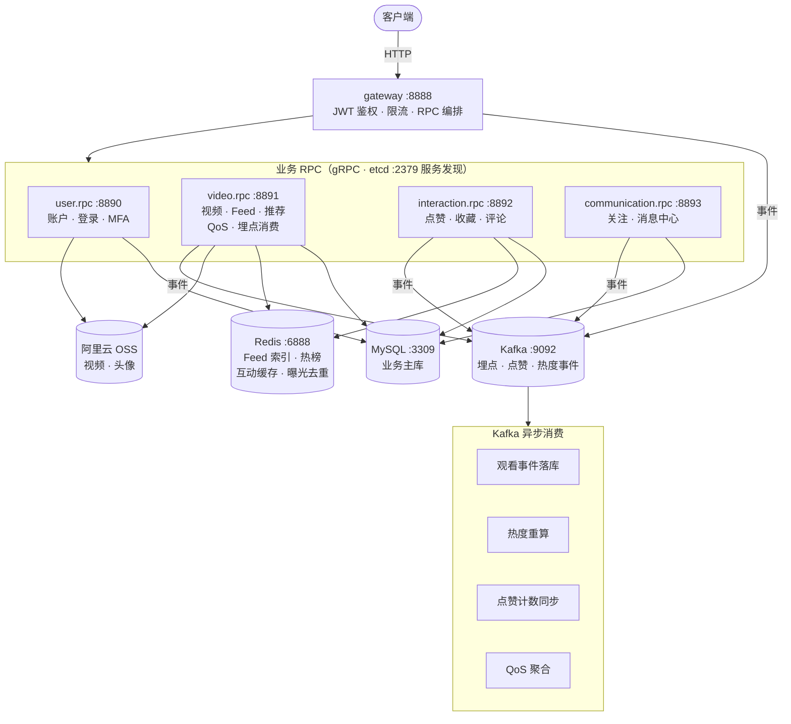
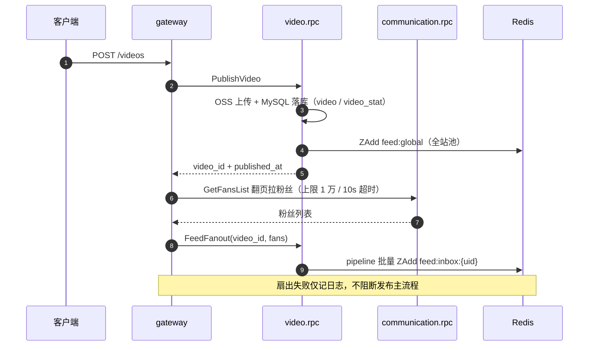
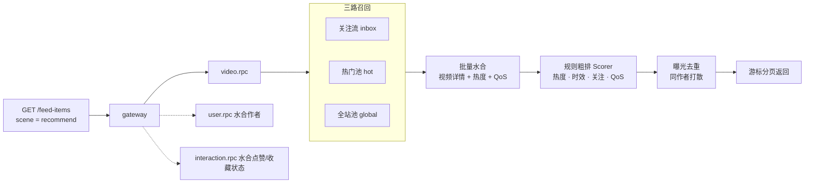
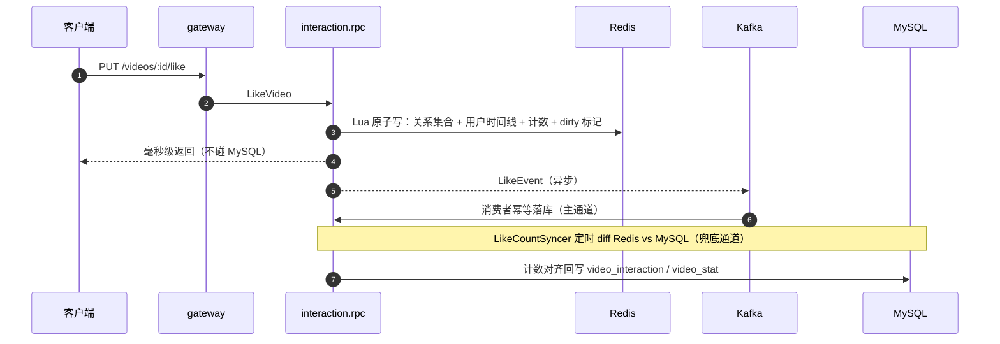
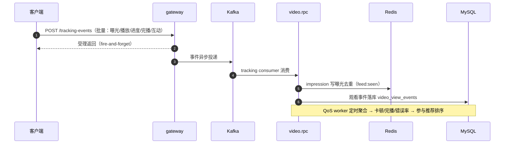

# go-zero-tiktok

基于 [go-zero](https://go-zero.dev) 的短视频平台后端（仿 TikTok），**网关 + 4 个 gRPC 微服务**，覆盖账户、视频、互动、关系、消息五大业务域。当前主线：构建**可解释、可控且播放质量（QoE）感知的推荐飞轮** → [docs/下一阶段发展规划-推荐飞轮与QoE.md](docs/下一阶段发展规划-推荐飞轮与QoE.md)。

[](https://go.dev)
[](https://go-zero.dev)
[](https://grpc.io)
[](LICENSE)

---

## 系统架构



| 服务 | 职责 | 端口 | 目录 |
|---|---|---|---|
| gateway | HTTP 网关：鉴权、限流、跨服务编排 | 8888 | `app/gateway/api` |
| user.rpc | 注册 / 登录 / 刷新令牌 / MFA | 8890 | `app/user/rpc` |
| video.rpc | 视频、搜索、热门、Feed 四种 scene、规则推荐、播放 QoS、埋点消费 | 8891 | `app/video/rpc` |
| interaction.rpc | 点赞、收藏、评论、回复 | 8892 | `app/interaction/rpc` |
| communication.rpc | 关注 / 粉丝 / 互关；消息中心（通知 / 未读 / 已读） | 8893 | `app/communication/rpc` |

各 RPC 内部采用 `domain`（业务逻辑）/ `dal`（数据访问）分层；**RPC 之间禁止互调**，跨服务需求由 gateway 编排。

---

## 核心业务流程

### 1. 发布视频与关注流扇出（推模式）

发布路径只写一次索引，读取时粉丝直接命中自己的 inbox，读路径零额外开销。



### 2. Feed 推荐链路（三路召回 + 规则粗排）



### 3. 点赞 / 收藏：异步最终一致

请求路径只碰 Redis（Lua 原子写），毫秒级返回；落库走"Kafka 主通道 + 定时 Syncer 兜底"双通道。



### 4. 行为埋点回流（推荐飞轮的输入）

真实观看行为回流落库，聚合结果反哺推荐排序——这是当前推荐系统的数据飞轮入口。



---

## 核心特性

- **Feed 四种 scene**：`timeline` 全站 / `following` 关注流 / `hot` 热度榜 / `recommend` 规则推荐，游标分页
- **规则推荐**：关注流 / 热门 / 全站三路召回，热度·时效·关注·QoS 规则粗排，曝光去重，同作者打散
- **行为埋点**：曝光 / 播放 / 进度 / 完播 / 互动统一上报，Kafka 消费落库
- **播放 QoS**：卡顿 / 错误 / 码率上报聚合，聚合结果参与推荐排序
- **消息中心**：点赞 / 评论 / 关注站内通知，未读数、批量已读，`receiver_id + event_id` 幂等
- **可观测性**：Prometheus 指标端点、zap 结构化日志（trace_id 注入）、Loki / Alloy / Grafana 日志链路
- **质量保障**：100+ 表驱动单元测试（纯 Go SQLite，无 cgo），golangci-lint CI

---

## 技术栈

| 分类 | 选型 |
|---|---|
| 语言 / 框架 | Go 1.21+、go-zero（goctl 代码生成）、GORM |
| 服务通信 | gRPC + protobuf、etcd 服务发现 |
| 存储 | MySQL 8.0、Redis 7.2、Kafka 4.0、阿里云 OSS |
| 鉴权 | JWT（Access + Refresh）、MFA（TOTP） |
| 日志 / 监控 | zap、Prometheus、Loki / Alloy / Grafana |
| 工程化 | golangci-lint、GitHub Actions、Docker Compose、golang-migrate |

---

## 快速开始

前置：Go 1.21+、Docker Compose。

```bash
# 1. 基础设施（etcd / MySQL / Redis / Kafka）+ 建表
make infra-up && make migrate-up

# 2. 构建 + 启动（每个服务一个终端）
make build-local
make run-gateway-local        # HTTP :8888
make run-user-local           # RPC  :8890
make run-video-local          # RPC  :8891
make run-interaction-local    # RPC  :8892
make run-communication-local  # RPC  :8893

# 3. 验证
curl -X POST http://localhost:8888/users -d "username=alice&password=123456"
```

所有连接信息通过**环境变量**注入（`app/*/etc/*.yaml` 全部为 `${ENV}` 占位符），本地默认值见下表，服务器部署只改环境文件、不动 yaml：

| 变量 | 用途 | 默认值 |
|---|---|---|
| `ETCD_HOSTS` | etcd 地址 | `127.0.0.1:2379` |
| `MYSQL_HOST` / `MYSQL_PORT` / `MYSQL_PASSWORD` | MySQL | `127.0.0.1` / `3309` / `yourpassword` |
| `REDIS_HOST` | Redis | `127.0.0.1:6888` |
| `KAFKA_BROKERS` | Kafka | `127.0.0.1:9092` |
| `ACCESS_SECRET` | JWT 签名密钥（**5 个服务必须一致**） | `your_access_secret` |
| `OTLP_ENDPOINT` | 链路追踪导出（可选） | `localhost:4317` |

其他常用命令：

| 命令 | 说明 |
|---|---|
| `make monitoring-up` | 启停 Loki / Alloy / Grafana 日志监控（可选） |
| `make migrate-down` | 回滚最近 1 个迁移版本 |
| `make test` / `make vet` / `make fmt` | 测试 / 静态检查 / 格式化 |
| `make db-shell` | 进入 MySQL 容器 |

> 生产部署形态：基础设施走 Docker Compose，5 个业务服务编译为二进制、systemd 托管，环境变量集中在 `/etc/go-zero-tiktok/env`；接口契约与文档索引见 [docs/README.md](docs/README.md)。
