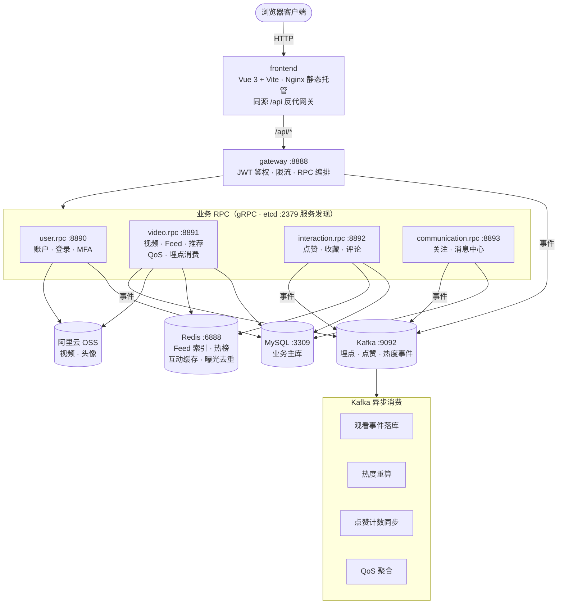
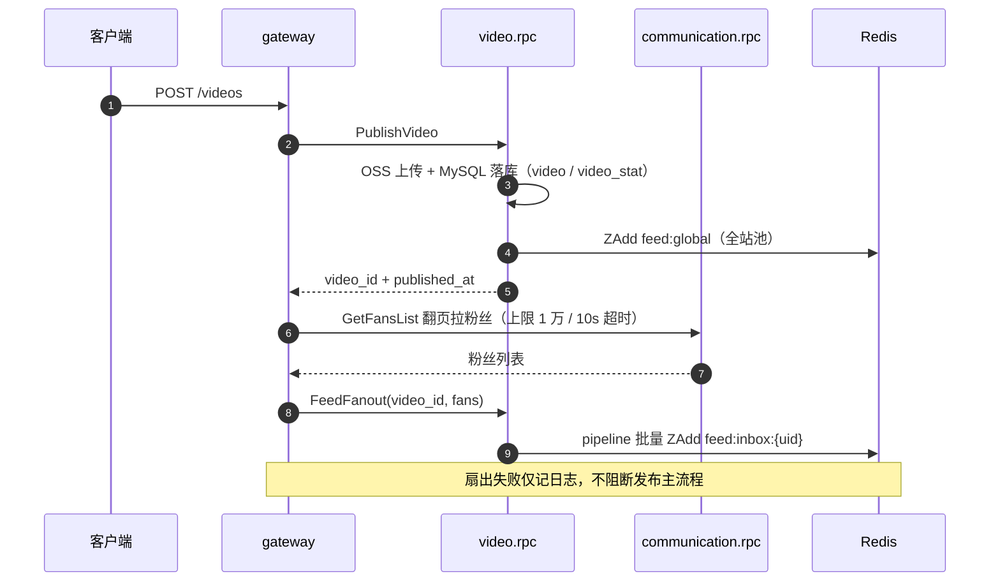
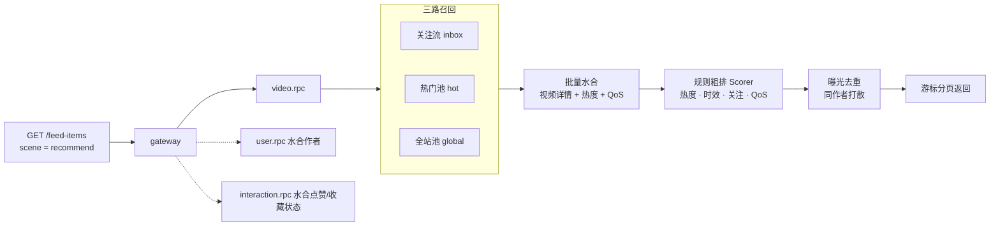
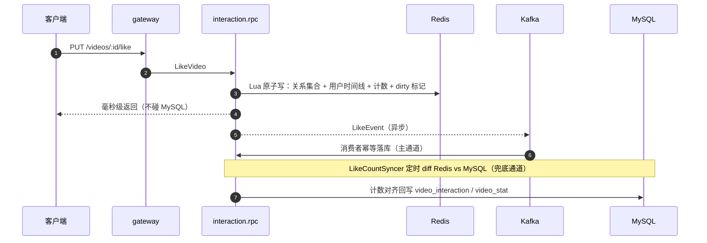
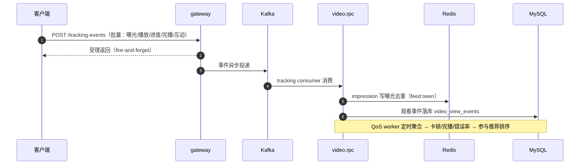
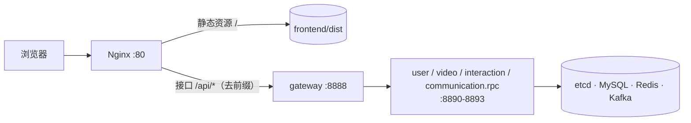

# go-zero-tiktok

基于 [go-zero](https://go-zero.dev) 的短视频平台（仿 TikTok）：**网关 + 4 个 gRPC 微服务 + Vue 3 前端**，覆盖账户、视频、互动、关系、消息五大业务域。当前主线：构建**可解释、可控且播放质量（QoE）感知的推荐飞轮** → [docs/下一阶段发展规划-推荐飞轮与QoE.md](docs/下一阶段发展规划-推荐飞轮与QoE.md)。

[](https://go.dev)
[](https://go-zero.dev)
[](https://grpc.io)
[](LICENSE)

---

## 系统架构


```mermaid
flowchart TB
    client(["浏览器客户端"])

    web["frontend<br/>Vue 3 + Vite · Nginx 静态托管<br/>同源 /api 反代网关"]

    gw["gateway :8888<br/>JWT 鉴权 · 限流 · RPC 编排"]

    subgraph rpcs["业务 RPC（gRPC · etcd :2379 服务发现）"]
        direction LR
        user["user.rpc :8890<br/>账户 · 登录 · MFA"]
        video["video.rpc :8891<br/>视频 · Feed · 推荐<br/>QoS · 埋点消费"]
        inter["interaction.rpc :8892<br/>点赞 · 收藏 · 评论"]
        comm["communication.rpc :8893<br/>关注 · 消息中心"]
    end

    mysql[("MySQL :3309<br/>业务主库")]
    redis[("Redis :6888<br/>Feed 索引 · 热榜<br/>互动缓存 · 曝光去重")]
    kafka[("Kafka :9092<br/>埋点 · 点赞 · 热度事件")]
    oss[("阿里云 OSS<br/>视频 · 头像")]

    subgraph consume["Kafka 异步消费"]
        direction LR
        c1["观看事件落库"]
        c2["热度重算"]
        c3["点赞计数同步"]
        c4["QoS 聚合"]
    end

    client -- HTTP --> web
    web -- "/api/*" --> gw
    gw --> rpcs

    user & video & inter & comm --> mysql
    video & inter --> redis
    user & video --> oss
    gw & video & inter & comm -- "事件" --> kafka
    kafka --> consume
```

| 服务 | 职责 | 端口 | 目录 |
|---|---|---|---|
| frontend | 用户端 Web：Feed / 搜索 / 发布 / 资料 / 消息 / 登录 | 5173（dev）· 80（prod） | `frontend/` |
| gateway | HTTP 网关：鉴权、限流、跨服务编排 | 8888 | `app/gateway/api` |
| user.rpc | 注册 / 登录 / 刷新令牌 / MFA | 8890 | `app/user/rpc` |
| video.rpc | 视频、搜索、热门、Feed 四种 scene、规则推荐、播放 QoS、埋点消费 | 8891 | `app/video/rpc` |
| interaction.rpc | 点赞、收藏、评论、回复 | 8892 | `app/interaction/rpc` |
| communication.rpc | 关注 / 粉丝 / 互关；消息中心（通知 / 未读 / 已读） | 8893 | `app/communication/rpc` |

各 RPC 内部采用 `domain`（业务逻辑）/ `dal`（数据访问）分层；**RPC 之间禁止互调**，跨服务需求由 gateway 编排。

---

## 核心业务流程

### 1. 发布视频与关注流扇出（推模式）

发布路径只写一次索引，读取时粉丝直接命中自己的 inbox，读路径零额外开销。


```mermaid
sequenceDiagram
    autonumber
    participant C as 客户端
    participant GW as gateway
    participant VR as video.rpc
    participant CR as communication.rpc
    participant R as Redis

    C->>GW: POST /videos
    GW->>VR: PublishVideo
    VR->>VR: OSS 上传 + MySQL 落库（video / video_stat）
    VR->>R: ZAdd feed:global（全站池）
    VR-->>GW: video_id + published_at
    GW->>CR: GetFansList 翻页拉粉丝（上限 1 万 / 10s 超时）
    CR-->>GW: 粉丝列表
    GW->>VR: FeedFanout(video_id, fans)
    VR->>R: pipeline 批量 ZAdd feed:inbox:{uid}

    Note over GW,R: 扇出失败仅记日志，不阻断发布主流程
```

### 2. Feed 推荐链路（三路召回 + 规则粗排）


```mermaid
flowchart LR
    A["GET /feed-items<br/>scene = recommend"] --> GW[gateway]
    GW --> V[video.rpc]

    subgraph recall["三路召回"]
        direction LR
        r1[关注流 inbox]
        r2[热门池 hot]
        r3[全站池 global]
    end

    V --> recall
    recall --> H["批量水合<br/>视频详情 + 热度 + QoS"]
    H --> S["规则粗排 Scorer<br/>热度 · 时效 · 关注 · QoS"]
    S --> D["曝光去重<br/>同作者打散"]
    D --> O["游标分页返回"]

    GW -.-> U[user.rpc 水合作者]
    GW -.-> I[interaction.rpc 水合点赞/收藏状态]
```

### 3. 点赞 / 收藏：异步最终一致

请求路径只碰 Redis（Lua 原子写），毫秒级返回；落库走"Kafka 主通道 + 定时 Syncer 兜底"双通道。


```mermaid
sequenceDiagram
    autonumber
    participant C as 客户端
    participant GW as gateway
    participant IR as interaction.rpc
    participant R as Redis
    participant K as Kafka
    participant DB as MySQL

    C->>GW: PUT /videos/:id/like
    GW->>IR: LikeVideo
    IR->>R: Lua 原子写：关系集合 + 用户时间线 + 计数 + dirty 标记
    IR-->>C: 毫秒级返回（不碰 MySQL）
    IR-->>K: LikeEvent（异步）

    K->>IR: 消费者幂等落库（主通道）
    Note over IR,DB: LikeCountSyncer 定时 diff Redis vs MySQL（兜底通道）
    IR->>DB: 计数对齐回写 video_interaction / video_stat
```

### 4. 行为埋点回流（推荐飞轮的输入）

真实观看行为回流落库，聚合结果反哺推荐排序——这是当前推荐系统的数据飞轮入口。


```mermaid
sequenceDiagram
    autonumber
    participant C as 客户端
    participant GW as gateway
    participant K as Kafka
    participant VR as video.rpc
    participant R as Redis
    participant DB as MySQL

    C->>GW: POST /tracking-events（批量：曝光/播放/进度/完播/互动）
    GW-->>C: 受理返回（fire-and-forget）
    GW->>K: 事件异步投递
    K->>VR: tracking consumer 消费
    VR->>R: impression 写曝光去重（feed:seen）
    VR->>DB: 观看事件落库 video_view_events
    Note over VR,DB: QoS worker 定时聚合 → 卡顿/完播/错误率 → 参与推荐排序
```

---

## 核心特性

- **Feed 四种 scene**：`timeline` 全站 / `following` 关注流 / `hot` 热度榜 / `recommend` 规则推荐，游标分页
- **规则推荐**：关注流 / 热门 / 全站三路召回，热度·时效·关注·QoS 规则粗排，曝光去重，同作者打散
- **行为埋点**：曝光 / 播放 / 进度 / 完播 / 互动统一上报，Kafka 消费落库
- **播放 QoS**：卡顿 / 错误 / 码率上报聚合，聚合结果参与推荐排序
- **消息中心**：点赞 / 评论 / 关注站内通知，未读数、批量已读，`receiver_id + event_id` 幂等
- **可观测性**：Prometheus 指标端点、zap 结构化日志（trace_id 注入）、Loki / Alloy / Grafana 日志链路
- **质量保障**：100+ 表驱动单元测试（纯 Go SQLite，无 cgo），golangci-lint CI

---

## 技术栈

| 分类 | 选型 |
|---|---|
| 语言 / 框架 | Go 1.21+、go-zero（goctl 代码生成）、GORM |
| 前端 | Vue 3（组合式 API）、Vue Router、Pinia、Axios、Vite；Nginx 静态托管与 `/api` 反代 |
| 服务通信 | gRPC + protobuf、etcd 服务发现 |
| 存储 | MySQL 8.0、Redis 7.2、Kafka 4.0、阿里云 OSS |
| 鉴权 | JWT（Access + Refresh）、MFA（TOTP） |
| 日志 / 监控 | zap、Prometheus、Loki / Alloy / Grafana |
| 工程化 | golangci-lint、GitHub Actions、Docker Compose、golang-migrate |

---

## 快速开始

前置：Go 1.21+、Node 18+（前端）、Docker Compose。

```bash
# 1. 基础设施（etcd / MySQL / Redis / Kafka）+ 建表
make infra-up && make migrate-up

# 2. 构建 + 启动后端（每个服务一个终端）
make build-local
make run-gateway-local        # HTTP :8888
make run-user-local           # RPC  :8890
make run-video-local          # RPC  :8891
make run-interaction-local    # RPC  :8892
make run-communication-local  # RPC  :8893

# 3. 启动前端（另开一个终端）
make frontend-dev             # http://localhost:5173，经 /api 代理直连网关

# 4. 验证
curl -X POST http://localhost:8888/users -d "username=alice&password=123456"
```

所有连接信息通过**环境变量**注入（`app/*/etc/*.yaml` 全部为 `${ENV}` 占位符），本地默认值见下表，服务器部署只改环境文件、不动 yaml：

| 变量 | 用途 | 默认值 |
|---|---|---|
| `ETCD_HOSTS` | etcd 地址 | `127.0.0.1:2379` |
| `MYSQL_HOST` / `MYSQL_PORT` / `MYSQL_PASSWORD` | MySQL | `127.0.0.1` / `3309` / `yourpassword` |
| `REDIS_HOST` | Redis | `127.0.0.1:6888` |
| `KAFKA_BROKERS` | Kafka | `127.0.0.1:9092` |
| `ACCESS_SECRET` | JWT 签名密钥（**5 个服务必须一致**） | `your_access_secret` |
| `OTLP_ENDPOINT` | 链路追踪导出（可选） | `localhost:4317` |

其他常用命令：

| 命令 | 说明 |
|---|---|
| `make monitoring-up` | 启停 Loki / Alloy / Grafana 日志监控（可选） |
| `make migrate-down` | 回滚最近 1 个迁移版本 |
| `make test` / `make vet` / `make fmt` | 测试 / 静态检查 / 格式化 |
| `make db-shell` | 进入 MySQL 容器 |

---

## 部署

生产形态：**基础设施 Docker Compose 常驻 + 业务服务 systemd 托管二进制 + 前端静态资源 Nginx 托管并同源反代网关**。

采用**单域名同源**部署——Nginx 在 `/` 提供前端、在 `/api/` 反代网关，浏览器视角只有 Nginx 一个源：HttpOnly Cookie 直接携带，**无需后端 CORS，也不受 `SameSite=Lax` 跨站限制**。


```mermaid
flowchart LR
    U["浏览器"] --> N["Nginx :80"]
    N -- "静态资源 /" --> DIST[("frontend/dist")]
    N -- "接口 /api/*（去前缀）" --> GW["gateway :8888"]
    GW --> RPC["user / video / interaction / communication.rpc<br/>:8890-8893"]
    RPC --> INFRA[("etcd · MySQL · Redis · Kafka")]
```

### 1. 基础设施

```bash
make infra-up        # etcd / MySQL / Redis / Kafka（Docker Compose）
make migrate-up      # 建表（一次性）
```

### 2. 后端服务

```bash
make build-local     # 编译出 bin/{gateway,user-rpc,video-rpc,interaction-rpc,communication-rpc}
```

环境变量集中到 `/etc/go-zero-tiktok/env`（权限 `600`），`app/*/etc/*.yaml` 全部是 `${ENV}` 占位符。systemd 单元示例：

```ini
# /etc/systemd/system/gateway.service
[Unit]
Description=go-zero-tiktok gateway
After=network.target

[Service]
WorkingDirectory=/opt/go-zero-tiktok
EnvironmentFile=/etc/go-zero-tiktok/env
ExecStart=/opt/go-zero-tiktok/bin/gateway -f app/gateway/api/etc/tiktok-api.yaml
Restart=always

[Install]
WantedBy=multi-user.target
```

4 个 RPC 服务同构，仅 `ExecStart` 指向不同二进制与 yaml。

### 3. 前端

```bash
cd frontend
npm ci
npm run build        # 产物 frontend/dist，构建期 VITE_API_BASE=/api（见 frontend/.env.production）
```

把产物部署到 Nginx 站点根目录并启用 [deploy/nginx/tiktok-web.conf](deploy/nginx/tiktok-web.conf)：

```bash
sudo cp -r frontend/dist/* /var/www/go-zero-tiktok/
sudo cp deploy/nginx/tiktok-web.conf /etc/nginx/conf.d/tiktok-web.conf
sudo nginx -t && sudo systemctl reload nginx
```

前端请求统一走 `/api/*`，由 Nginx 去前缀反代到网关——`/messages`、`/users/:id/videos` 等与 SPA 路由同名的接口因此不再冲突。若改为跨机直连网关，运行时在页面右上角「连接设置」填完整地址即可（需后端放开 CORS 且满足同站 Cookie 约束）。

### 4. 上线检查清单

- [ ] `ACCESS_SECRET` 在 5 个后端服务中完全一致，否则跨服务 JWT 校验失败；
- [ ] Nginx `root` 指向构建产物、`/api/` 反代目标端口与网关一致；
- [ ] 反向代理透传 `Host` / `X-Real-IP` / `X-Forwarded-For`（限流与日志依赖真实 IP）；
- [ ] 生产密码等敏感值经环境文件注入，禁止提交进仓库。

---

接口契约与文档索引见 [docs/README.md](docs/README.md)。
